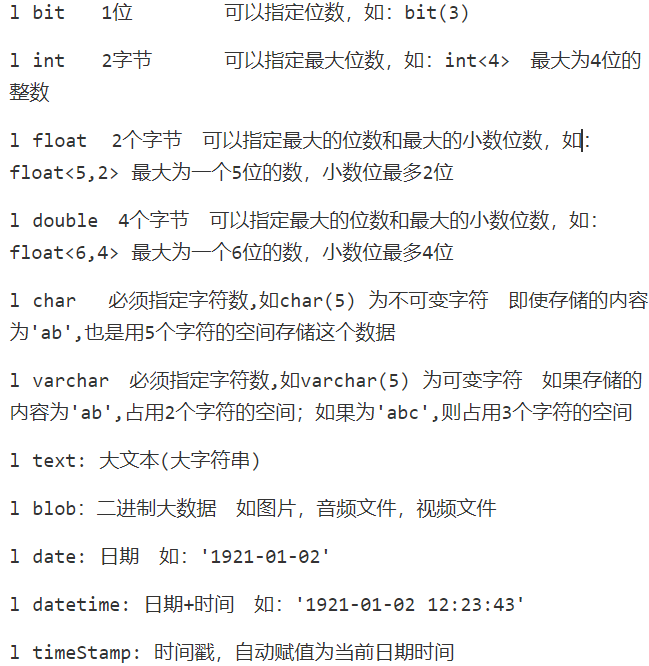

找文件 find locate 其中locate查找速度比find快

找语句 grep

# MySQL 基本操作

重启MySQL服务

systemctl **restart** mysqld d 代表守护进程

查看MySQL服务状态

systemctl **status** mysqld

停止MySQL服务

systemctl **stop** mysqld 

启动MySQL服务

systemctl **start** mysqld

# 数据库的增删改查

- ### 创建数据库database

  - create database 数据库名 character set 字符集(utf8);

在数据库中 每一条语句执行完毕都应该加上分号

- ### 查看数据库

  - 显示所有数据库
    - show databases;

  - 显示创建数据库的语句信息

    - show create database 数据库名

    - 反引号圈起来的字符串 区分大小写

  - 注意 ：mysql默认语言集是latin1，每次在创建数据库的时候应指定字符集。Oracle是在安装时，即指定了字符集。

- ### 修改数据库

  - alter database 数据库名 character set utf8;

  - 修改数据库的字符集为utf8 不能修改数据库名

- ### 删除数据库

  - drop database 数据库名 

  - 注:几个基本的数据库是不能够删除的

# 表的增删改查

- ### 创建表

  - 先选择在哪个表中使用数据库

    - use 数据库名

  - 数据类型

    - 

    - 

  - 查看表
    - show tables;

  - 查看指定表的创建语句
    - show create table 表名

  - mysql表名称区分大小写，对列名不区分大小写
  - 显示指定表的结构
    - desc 表名

- ### 删除表 

  - drop table 表名;

- ### 插入数据

  - insert into 表名(数据) 其中数据按照创建表时的格式填写，每一项用逗号隔开
    - 如果为空则填入NULL 字符串要在指定的大小之内 每个字符串用单引号括起来 

# C连接MySQL数据库

通过导入静态库 mysql.h 连接Mysql 首先创建一个MYSQL的对象 通过对mysql_init函数的返回值的判断 看是否连接成功

mysql_init(NULL);

mysql_real_connect(mysql_real_connect(mysql, __HOST__, __USER__, __PWD__, __DB__, 0, NULL, 0);)

mysql_init(连接对象名);

当数据库启动的时候 MYSQL数据库就开始监听

不需要开启服务 
